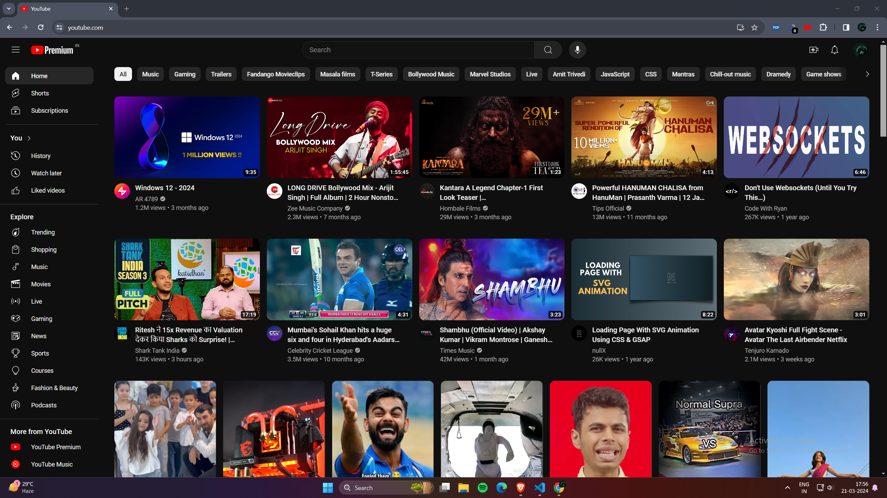

# youtube-premium-extension-faker
A Chrome Extension to replaces the YouTube logo with the Premium logo, giving the appearance of a premium subscription when viewing YouTube content.

#
</a>

#
# HOW TO INSTALL
1. Clone or download the repository & extract the ZIP file to a location on your computer.
2. Open your Chrome, Brave, or any other Chromium-based browser.
3. Locate and click on the "Extensions" at the top right corner of the panel. (usually represented by three vertical dots or lines)
4. In the Extensions, ensure that "Developer Mode" is enabled. This option is usually located at top of the section.
5. Once above steps done, click on the "Load unpacked" button located at the top left corner of the Extensions page.
6. A file explorer window will open. Navigate to the location where you cloned or extracted the repository, then select the folder containing the extension files. Click "Select Folder" to load the extension.
7. The extension should now appear in the list of installed extensions. Ensure that it's enabled by toggling the switch if necessary.
8. Finally, refresh the YouTube webpage (you may need to reload the page by pressing "Ctrl+R" or "Ctrl+Shift+R") and observe the changes to the YouTube logo.

#
## Credits
Created by <a href="https://nisargkavi.in">Nisarg Kavi</a>
If you reuse this code for personal purposes, please remember to give credit to the original repository.